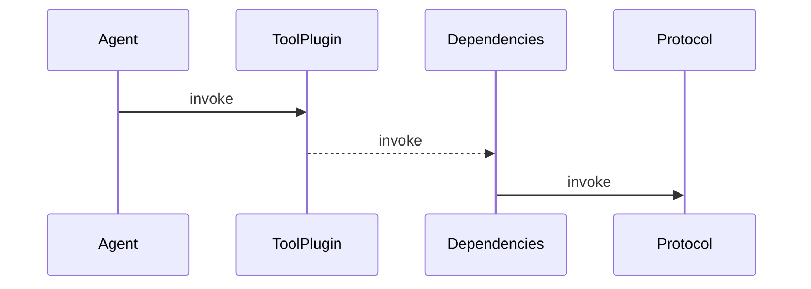
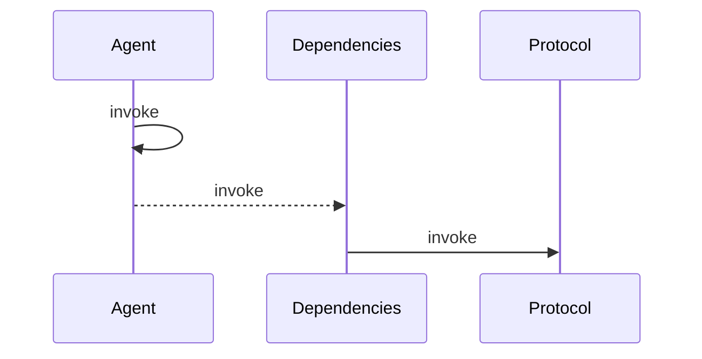
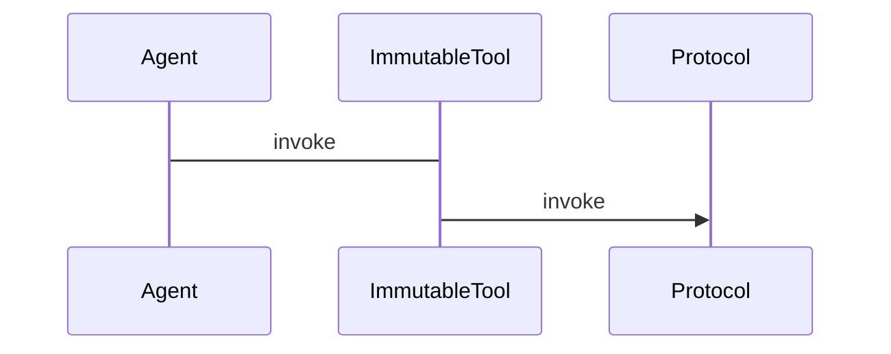

## Why Minimize dependencies

> Dependency minimalism (writing software that deliberately tries to have as few dependencies as practical) is a really underrated virtue imo. Every single dependency is a risk that "something will go wrong" during someone's installation process. Installing projects with hundreds of dependencies and walking through errors can be incredibly frustrating.

-- [@VitalikButerin](https://x.com/VitalikButerin/status/1880324753170256005)

The risk is real as we were told ["Stop using dapps"](https://decrypt.co/209804/ledger-library-compromised-with-wallet-drainer) where just one npm package got compromised and supply chain attacks is never new. Every dependency make it harder to audit. 

In the web context, dependencies make the bundle larger and the site slower.  [Island Architecture](https://docs.astro.build/en/concepts/islands/) --  we try to contain comopnents into static ones as plain markups and text when possible, and limit interacitivt to speicifc componenst. This help simplify diff across versions and make a larger chunk of the dApp served by IPFS which is immutable. This also help rendering infrequently updated contnet faster, composing different frameworks in a page and encourages pushing slow operations to the server. Typically, we postpone hydration for components requiring a connected wallet. 

In the context of autonomous agent, a simple package-lock.json is not sufficient to guarantee your agent keep running autonomously and safely. As dev we are just tired of [dependency hell](https://en.wikipedia.org/wiki/Dependency_hell).
As we argued in [Architecture](/design/architecture/), the challenge is even more prominent for diverse, decentralized agents than dApps.

Check out Extraordinary work at by paulmillr at [scure](https://github.com/paulmillr/scure-base).

## Immutability
We have seen power of autonomous execution in smart contracts which are immutable or upgradeable only upon restricted rules. 
Common primitives like Ethereum Attestation Service establish trust, promote interoperability and simplify audit. 

It is a common need for more flexible, blockchain agnoistic programs outside the EVM runtime that are immutable and verifiable, as in Lit actions and [Chainlink Functions](https://docs.chain.link/chainlink-functions) which are javascript based and executed by decentralized nodes, or dockerized applications execute in TEE.

With autonomous agents, it is crucial to ensure no one can update or remove the program and often it is desired to promote transparency. One typical approach is uploading that to IPFS and restrict execution to that content-addressing hash, as in [Lit's example](https://developer.litprotocol.com/sdk/serverless-signing/deploying#a-note-on-immutability).

Today every agent has its own dependency graph and often versions of pacakge differ given versions of frameworks. Creating common, immutable program as tools for agent could make developer life easy and ease audit.  

## Our approach

- We prefer downstream dependencies that is treeshakable.
- Consider `lib/filecoin/gateway.ts` `getGatewayUrlWithCid()` as an example, it does not import dependenceis unconditionally or relevavnt ecosystem-specific code are expected to be injected using strategy pattern.

Many frameworks adopt a plugin system, some limit dependencies to only plugin being used.

### Scenario #1

### Scenario #2

### Scenario #3

Improve scenario in #2 (reduced dependencies by design and removing wrapper)
Enable Scenario #3 where common , immutable hosted on IPFS and work with Lit Action.

Consider supplying USDC on Aave Protocol USDC. Aave, use ethers, aave-utilities and finally.

## Dependencies considerations

This documents rationale behind opionated dependencies

- For graphql / store related, refers to [data](/design/data)

- `vitest` over `jest`
  - used by shadcn, scaffold and generally author find less issues for typscript setup as in jest.

- Currently we use a small set of unix style stable, isomorphic lightweight libraries. 
  - `ky` over `fetch` to reduce boilerplates
  - use `URLSearchParams` over `fast-querystring`
  - unjs packages

- We want first class ESM support and thus
  - `vitest` over `jest` for testing 
  - `tsx` over `ts-node` for .mts execution

## Form
- we opt for shadcn form (react-hook-form) instead of radix ui form 
